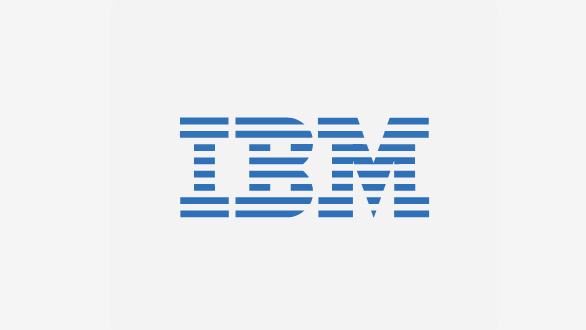

# Analytics Engine powered by Apache Spark



**Important:**
* Only one **Analytics Engine powered by Apache Spark** can be installed per namespace.
* If using a private Docker registry an image pull secret needs to be created before installing the chart.

## Introduction

You can use **Analytics Engine powered by Apache Spark** to run a variety of workloads on your IBM Cloud Pak for Data cluster:

  - Watson Studio notebooks that call Apache Spark APIs
  - Spark applications that run Spark SQL
  - Data transformation jobs
  - Data science jobs
  - Machine learning jobs

Each time you submit a job, a dedicated Spark cluster is created for the job. You can specify the size of the Spark driver, the size of the executor, and the number of executors for the job. This enables you to achieve predictable and consistent performance. When a job completes, the cluster is automatically cleaned up so that the resources are available for other jobs. The service also includes interfaces that enable you to analyze the performance of your Spark applications and debug problems.

## Chart Details

This chart deploys a single Analytics Engine powered by Apache Spark into a Kubernetes/Openshift environment. Quickly spin up light weight, Apache Spark clusters dedicated to each Spark job.

## Prerequisites

* Kubernetes 1.11.0 or later / Openshift 3.11 / Openshift 4.3.
* A user with cluster administrator role is required to install the chart.
* If persistence is enabled (see [configuration](#configuration)):
  * You must either create a persistent volume, or specify a storage class if classes are defined in your cluster.
  * The storage class must support read-write-many


## PodSecurityPolicy Requirements

Custom PodSecurityPolicy definition:

```
apiVersion: policy/v1beta1
kind: PodSecurityPolicy
metadata:
  name: ibm-chart-dev-psp
spec:
  allowPrivilegeEscalation: false
  readOnlyRootFilesystem: false
  allowedCapabilities:
  - CHOWN
  - DAC_OVERRIDE
  - SETGID
  - SETUID
  - NET_BIND_SERVICE
  seLinux:
    rule: RunAsAny
  supplementalGroups:
    rule: RunAsAny
  runAsUser:
    rule: RunAsAny
  fsGroup:
    rule: RunAsAny
  volumes:
  - configMap
  - secret
```

- Cluster administrator role is required for installation.

## SecurityContextConstraints Requirements

Custom SecurityContextConstraints definition:

```
apiVersion: security.openshift.io/v1
kind: SecurityContextConstraints
metadata:
  name: ibm-chart-dev-scc
readOnlyRootFilesystem: false
allowedCapabilities:
- CHOWN
- DAC_OVERRIDE
- SETGID
- SETUID
- NET_BIND_SERVICE
seLinuxContext:
  type: RunAsAny
supplementalGroups:
  type: RunAsAny
runAsUser:
  type: RunAsAny
fsGroup:
  rule: RunAsAny
volumes:
- configMap
- secret
```

[`ibm-restricted-psp`](https://ibm.biz/cpkspec-psp)
[`ibm-restricted-scc`](https://ibm.biz/cpkspec-scc)

This chart requires a SecurityContextConstraints to be bound to the target namespace prior to installation. To meet this requirement there may be cluster scoped as well as namespace scoped pre and post actions that need to occur.

The predefined SecurityContextConstraints [`ibm-anyuid-scc`](https://ibm.biz/cpkspec-scc) has been verified for this chart. If your target namespace is not bound to this SecurityContextConstraints resource you can bind it with the following command:

`oc adm policy add-scc-to-group ibm-anyuid-scc system:serviceaccounts:<namespace>` For example, for release into the `default` namespace:
``` 
oc adm policy add-scc-to-group ibm-anyuid-scc system:serviceaccounts:default
```

## Installing the Chart

Only one **Analytics Engine powered by Apache Spark** can be installed per namespace.

**Important:** If using a private Docker registry, an image pull secret needs to be created before installing the chart. Apply the name of the secret to all Service Accounts.

To install the chart with the release name `ibm-spark-prod`:

```
helm install --name ibm-spark-prod ibm-spark-prod --tls
```

## Verifying the Chart

See the instructions (from NOTES.txt, packaged with the chart) after the helm installation completes for chart verification. The instructions can also be viewed by running the command:
```
helm status ibm-spark-prod --tls.
```

## Uninstalling the Chart

To uninstall/delete the `ibm-spark-prod` release:

```
helm delete ibm-spark-prod --purge --tls
```

The command removes all the Kubernetes components associated with the chart.

## Configuration
The following table lists the configurable parameters of the `ibm-spark-prod` chart and their default values.

| Parameter                                 | Description                              | Default                                                    |
| ----------------------------------------- | ---------------------------------------- | ---------------------------------------------------------- |
| `global.dockerRegistryPrefix`             | Docker registry value                    | `docker-registry.default.svc:5000/hummingbird/`            |
| `global.architecture`                     | Control UI Docker image                  | `amd64`                          |
| `kernelCleanupCron.schedule`              | To cleanup idle notebooks spark cluster  | `"*/30 * * * *"`                                           |
| `jobCleanupCron.schedule`                 | To cleanup finished spark job cluster    | `"*/30 * * * *"`                                           |

Specify each parameter using the `--set key=value[,key=value]` argument to `helm install`.

Alternatively, a YAML file that specifies the values for the parameters can be provided while installing the chart.

## Storage
The **Analytics Engine powered by Apache Spark** requires a persistent volume to store spark job artefacts used by Spark History server. The default size of the persistent volume claim is 5Gi.

The persistent volume claim must have an access mode of ReadWriteMany (RWX), and must not use "hostPath" or "local" volumes.


## Resources Required

This chart has the following resource requirements:

- 4 CPU core
- 8 Gi memory

See the [configuration](#configuration) section for how to configure these values.

## Logging

The `log.format` value controls whether the format of the output logs is:
- basic: Human-readable format intended for use in development, such as when viewing through `kubectl logs`
- json: Provides more detailed information for viewing through Kibana

## Limitations
- You must create a pull secret if you are using external docker image registry.   
- You must install IBM Cloud Pak for Data before installing Analytics Engine powered by Apache Spark.